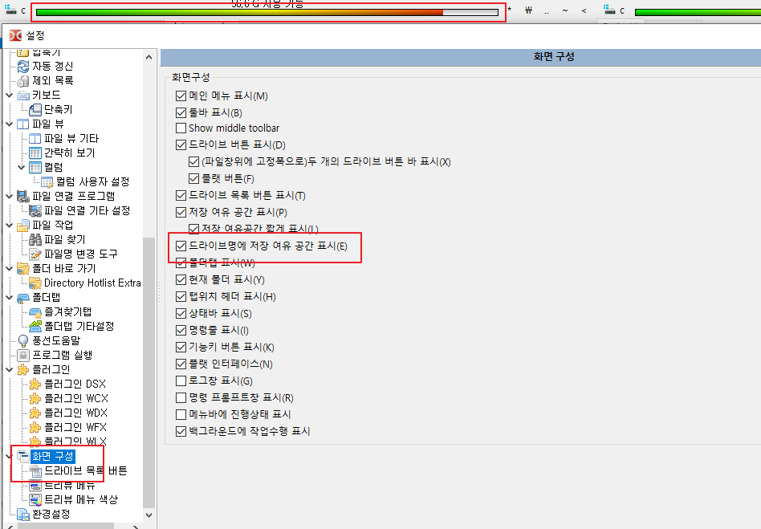

# 환경 설정.

## 목록
- [설치 하기](#설치하기)
- [외부 편집기 설정](#외부-편집기)
- [파일 작업 설정](#파일-작업)
  - 파일 이름 변경시 확장자 제외 하고 파일 이름만 선택되도록 설정하기
- [아이콘 설정](#아이콘)
  - 파일에 오버레이 아이콘 표시 하도록 수정.
- [화면 구성](#화면-구성)
  - 드라이브명에 저장 여유 공간 게이지바로 표시
- [색상 - 파일, 폴더 색상 변경](#색상)

<br><br>

------

### 설치하기
- [더블 코맨더 홈](https://sourceforge.net/p/doublecmd/wiki/Download/)   

- 맥에 설치하기 :  mac os 11 이하일때. version 0.9.10-9640
```
$ brew install --cask double-commander
```
- mac os 11 이상일때
[다운로드](https://doublecmd.sourceforge.io/site/eng/snapshots.php)


<br>

-------
### 외부 편집기
- 외부 편집기를 사용하기 위해 설정.
- Visual Studio Code 를 설정했음.
   

<br>

-------
### 파일 작업
- 파일이름 변경시 파일 이름만 선택되도록 설정 하기.(확장자는 선택 안됨)


<br>

-------
### 아이콘
- 형상관리(SVN, GIT)나 기타 파일 상태에 따른 오버레이 아이콘이 나오도록 설정
- 메뉴에 아이콘 보이기 설정.


<br>

------
### 화면 구성


<br>

------
### 색상
#### 파일 포멧
- 카테고리 속성 : d*   (모든 디렉토리)
  - dc 에 보면 속성탭이 있음. 거기에 표시 되는거 쓰면 됨.
  - 디렉토리는 d 로 시작.
  - 파일은 - 로 시작.

- 파일 색상 변경하기
  - 카테고리 속성은 비워 두면 됨. 속성에 따라 색깔을 다르게 할 경우 사용.  - 로 시작해야함.
```
- 카테고리 마스크
  - 구분자 ; 사용.
  
*.h;*.cpp
```


<br>


